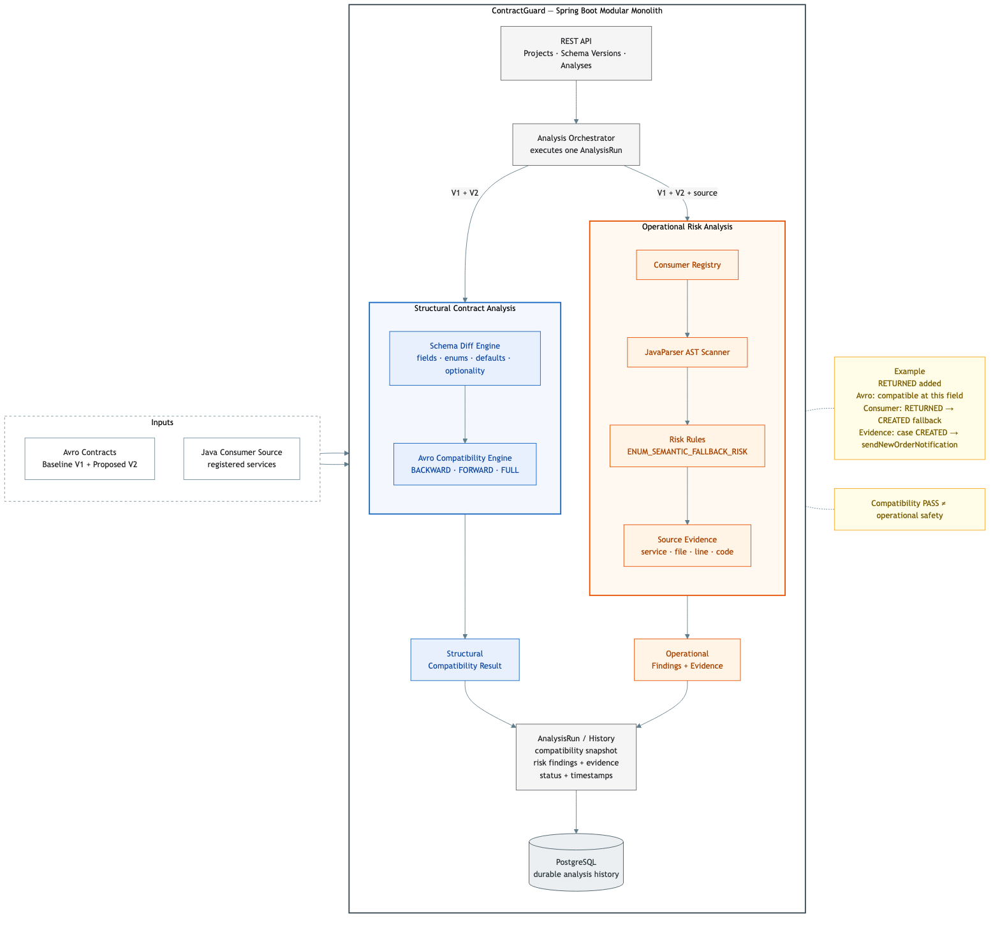
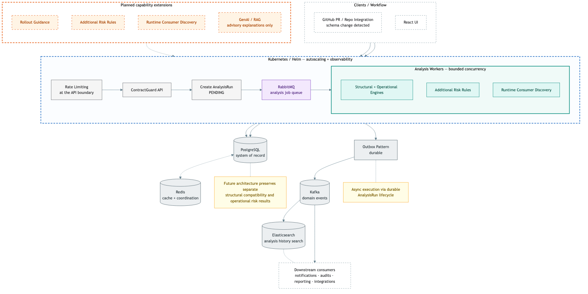

# ContractGuard

**A compatibility PASS does not imply operational safety.**

Schema compatibility checks answer one question: *can a reader built for one schema version decode
data written for the other?* They answer it from the two schemas alone, and say nothing about the
code that consumes the data. So a contract change can be structurally compatible and still break a
downstream service — compatibility rules constrain **encoding and decoding**, while outages come
from **application logic**.

Adding an Avro enum symbol is the canonical example. An enum default may allow a reader to resolve
a newly added symbol without any compatibility issue being reported for that field. The failure is
not that a `switch` lacks the new case — it is that the new symbol never reaches the consumer at
all: the old reader resolves it to the enum's default, and the consumer then executes whatever
business behaviour it attaches to that fallback value, on records that meant something else.

ContractGuard's eventual goal is to report two *independent* results for a proposed schema change —
structural compatibility, and operational risk backed by evidence from consumer source — and never
to merge them into a single verdict. It provides risk analysis and engineering guidance; it does not
certify that a deployment is safe.

## Architecture

### Current architecture



**Legend** — blue: structural contract analysis · orange: operational risk analysis · grey: API,
orchestration, history and storage · dashed: inputs and planned components.

Structural compatibility and operational risk are computed by independent engines and stored as
separate result sets on one `AnalysisRun`. Java consumer source feeds only the operational-risk
branch — it is never an input to Avro compatibility.

### Planned architecture evolution



Infrastructure is introduced only where a concrete scalability or reliability need justifies it.
Per-component rationale and the editable Mermaid source: [`docs/architecture.md`](docs/architecture.md).

## Status

Early development. What works today:

- Create projects
- Store Avro schema versions in a project, with validation, SHA-256 content hashing and duplicate rejection
- Compare two stored versions and get a deterministic, field-level structural diff
- Analyse backward, forward and full structural compatibility between two stored versions
- Analyse operational risk against Java consumer source, independently of compatibility
- Persist every analysis as a durable, auditable snapshot
- Derive deterministic rollout guidance from a stored analysis
- **A React + TypeScript UI covering the full workflow**

Not built yet: asynchronous execution and the remaining consumer risk rules.

## Web UI

A React + TypeScript UI covers the whole workflow: create a project, store schema versions, run an
analysis, and read the persisted result.

```bash
cd frontend && npm install && npm run dev
```

Open <http://localhost:5173>. The dev server proxies `/api` to the backend on `8081`, so the browser
stays on one origin and the backend needs no CORS configuration. Point it elsewhere with
`CONTRACTGUARD_API_URL`.

With Docker Compose the UI is served by nginx on `${CONTRACTGUARD_WEB_PORT:-5173}`, proxying `/api`
to the backend container.

| Screen | Purpose |
|---|---|
| Projects | Project list and creation |
| Project | Schema versions, run an analysis, analysis history |
| Analysis | Structural compatibility, operational risk with source evidence, rollout guidance |

The analysis screen keeps compatibility and operational risk in separate sections and never renders
a combined safe/unsafe verdict. Opening a historical analysis reads the stored snapshot — it does
not re-run anything.

```bash
cd frontend && npm test
```

## Requirements

* JDK 21 and Docker — or just Docker, if you use Compose
* A running Docker daemon is required for the integration tests

## Running with Docker Compose

```bash
docker compose up -d --build
```

This starts PostgreSQL and the application. Ports are environment-overridable so a local PostgreSQL
or another service on 8080 does not block startup — the defaults deliberately avoid both:

| Variable | Default | Purpose |
|---|---|---|
| `CONTRACTGUARD_PORT` | `8081` | Host port for the application |
| `CONTRACTGUARD_DB_PORT` | `55432` | Host port for PostgreSQL |
| `CONTRACTGUARD_DB_NAME` | `contractguard` | Database name |
| `CONTRACTGUARD_DB_USERNAME` | `contractguard` | Database user |
| `CONTRACTGUARD_DB_PASSWORD` | `contractguard` | Database password |

```bash
curl -s http://localhost:8081/api/v1/health
```

Stop with `docker compose down`, or `docker compose down -v` to also drop the database volume.

## Running locally without Compose

Start a database, then the app:

```bash
docker run --rm -d --name contractguard-db -e POSTGRES_DB=contractguard -e POSTGRES_USER=contractguard -e POSTGRES_PASSWORD=contractguard -p 55432:5432 postgres:16-alpine
```

```bash
CONTRACTGUARD_DB_URL=jdbc:postgresql://localhost:55432/contractguard ./mvnw spring-boot:run
```

Flyway applies the migrations on first startup. The app binds to `127.0.0.1:8080` by default;
override with `CONTRACTGUARD_PORT` and `CONTRACTGUARD_BIND_ADDRESS`.

## Tests

```bash
./mvnw clean verify
```

Unit tests are plain JUnit. Integration tests start a real PostgreSQL through Testcontainers, so
Flyway and the JPA mapping are genuinely exercised — they need a running Docker daemon.

## API

| Method | Path | Purpose |
|---|---|---|
| `POST` | `/api/v1/projects` | Create a project |
| `GET` | `/api/v1/projects` | List projects |
| `GET` | `/api/v1/projects/{projectId}` | Get a project |
| `POST` | `/api/v1/projects/{projectId}/schemas` | Store a schema version |
| `GET` | `/api/v1/projects/{projectId}/schemas` | List schema versions |
| `GET` | `/api/v1/projects/{projectId}/schemas/{schemaVersionId}` | Get a schema version |
| `GET` | `/api/v1/projects/{projectId}/schemas/{sourceId}/diff/{targetId}` | Structural diff of two versions |
| `GET` | `/api/v1/projects/{projectId}/schemas/{sourceId}/compatibility/{targetId}` | Compatibility analysis of two versions |
| `GET` | `/api/v1/projects/{projectId}/schemas/{sourceId}/risk/{targetId}` | Operational risk against consumer source |
| `POST` | `/api/v1/projects/{projectId}/analyses` | Run and persist a full analysis |
| `GET` | `/api/v1/projects/{projectId}/analyses` | Analysis history, newest first |
| `GET` | `/api/v1/analyses/{analysisId}` | Full persisted snapshot |
| `GET` | `/api/v1/analyses/{analysisId}/rollout` | Rollout guidance derived from that snapshot |
| `GET` | `/api/v1/health` | Health check |

Diff, compatibility and risk are deliberately **separate endpoints with separate payloads**. A diff
says *what* changed; compatibility says whether readers and writers can still resolve each other;
risk says which consumer code could misbehave. None of them says a deployment is safe.

Errors are [RFC 9457](https://www.rfc-editor.org/rfc/rfc9457) problem responses. A malformed schema
returns `400`, an unknown id `404`, and a duplicate schema or project name `409`.

### Schema rules

* The root type must be an Avro **record**. Primitives, enums, arrays and unions are rejected at the
  root; they remain valid anywhere below it.
* Schemas are hashed after normalization, so reformatting or reordering JSON keys does not create a
  new version — but a changed `default` or `doc` does.
* The same schema cannot be stored twice in one project. It may exist in different projects.

## Sample: comparing two schema versions

The repository ships one built-in sample domain, e-commerce order events, at
[`src/main/resources/samples/ecommerce-order/`](src/main/resources/samples/ecommerce-order/).
`order-v1.avsc` is the baseline and `order-v2.avsc` the proposed change.

With the stack running on port 8081:

```bash
BASE=http://localhost:8081/api/v1; SAMPLES=src/main/resources/samples/ecommerce-order
PROJECT=$(curl -s -X POST $BASE/projects -H 'Content-Type: application/json' -d '{"name":"E-commerce Orders"}' | python3 -c 'import sys,json;print(json.load(sys.stdin)["id"])')
V1=$(python3 -c "import json;print(json.dumps({'schemaContent':open('$SAMPLES/order-v1.avsc').read()}))" | curl -s -X POST $BASE/projects/$PROJECT/schemas -H 'Content-Type: application/json' --data-binary @- | python3 -c 'import sys,json;print(json.load(sys.stdin)["id"])')
V2=$(python3 -c "import json;print(json.dumps({'schemaContent':open('$SAMPLES/order-v2.avsc').read()}))" | curl -s -X POST $BASE/projects/$PROJECT/schemas -H 'Content-Type: application/json' --data-binary @- | python3 -c 'import sys,json;print(json.load(sys.stdin)["id"])')
curl -s "$BASE/projects/$PROJECT/schemas/$V1/diff/$V2" | python3 -m json.tool
```

### Example diff response

```json
{
  "projectId": "3c33e390-e0d9-40a3-b70a-c3b794c5cd02",
  "sourceVersion": {
    "id": "30bdc811-e68f-438c-95c5-28b14b3306e9",
    "projectId": "3c33e390-e0d9-40a3-b70a-c3b794c5cd02",
    "versionNumber": 1,
    "contentHash": "5fcacdf714e68e933bbd7f78713b4693d33b06ea86b92e2e7a99a00e970d49d5",
    "createdAt": "2026-08-09T14:02:41.428424Z"
  },
  "targetVersion": {
    "id": "d957fca1-563a-45a9-aaca-06e2b2c24372",
    "projectId": "3c33e390-e0d9-40a3-b70a-c3b794c5cd02",
    "versionNumber": 2,
    "contentHash": "93b5a59969945498b3d3c918ec2e688bf8b7d2f06991d2c8dc30b7e9fe51c07d",
    "createdAt": "2026-08-09T14:02:41.466838Z"
  },
  "changeCount": 6,
  "changes": [
    {"path": "OrderEvent.channel", "changeType": "FIELD_ADDED", "oldValue": null, "newValue": "string"},
    {"path": "OrderEvent.currency", "changeType": "DEFAULT_VALUE_CHANGED", "oldValue": "USD", "newValue": "UNSPECIFIED"},
    {"path": "OrderEvent.customerEmail", "changeType": "DEFAULT_VALUE_CHANGED", "oldValue": null, "newValue": "null"},
    {"path": "OrderEvent.customerEmail", "changeType": "FIELD_OPTIONALITY_CHANGED", "oldValue": "REQUIRED", "newValue": "OPTIONAL"},
    {"path": "OrderEvent.items[].discountCents", "changeType": "FIELD_ADDED", "oldValue": null, "newValue": "union<null,int>"},
    {"path": "OrderEvent.status", "changeType": "ENUM_SYMBOL_ADDED", "oldValue": null, "newValue": "RETURNED"}
  ]
}
```

`oldValue` is serialized as an explicit `null` rather than omitted — in a diff, "this did not exist
in the source schema" is information. Note the third and fourth entries: `null` means *no default
was declared*, while the string `"null"` means *the default is JSON null*.

The `RETURNED` symbol is the motivating case for the whole project. It is backward compatible by
Avro's rules, yet a consumer that gives the enum default its own business behaviour can still
misbehave. [Operational risk analysis](#operational-risk-analysis) connects this change to the
consumer line that would break.

## Compatibility analysis

Compatibility semantics come from Apache Avro's own resolution rules — ContractGuard does not invent
them. It only chooses which schema plays the reader, and translates Avro's findings into a stable
API shape.

| Mode | Question | Reader | Writer |
|---|---|---|---|
| `BACKWARD` | Can the **new** schema read data written with the **old** one? | target | source |
| `FORWARD` | Can the **old** schema read data written with the **new** one? | source | target |
| `FULL` | Do both hold? | derived from the two above | |

`FULL` carries no issues of its own; it names the failing direction, and the detail lives on
`backward` or `forward`. Issue paths are resolved against **that mode's reader schema** and use the
same dotted notation as the diff, e.g. `OrderEvent.items[].sku`.

### Example: compatibility fails

Comparing the built-in sample `order-v1.avsc` → `order-v2.avsc`:

```json
{
  "sourceVersion": { "versionNumber": 1, "contentHash": "5fcacdf7…" },
  "targetVersion": { "versionNumber": 2, "contentHash": "93b5a599…" },
  "results": {
    "backward": {
      "mode": "BACKWARD",
      "status": "PASS",
      "summary": "The target schema can read data written with the source schema.",
      "issues": []
    },
    "forward": {
      "mode": "FORWARD",
      "status": "FAIL",
      "summary": "The source schema cannot read data written with the target schema. 1 incompatibility found.",
      "issues": [
        {
          "issueType": "TYPE_MISMATCH",
          "path": "OrderEvent.customerEmail",
          "reason": "The type at OrderEvent.customerEmail cannot be resolved between the two schemas: reader type: STRING not compatible with writer type: NULL."
        }
      ]
    },
    "full": {
      "mode": "FULL",
      "status": "FAIL",
      "summary": "FULL requires both directions; FORWARD failed.",
      "issues": []
    }
  }
}
```

**Reading this.** `order-v2.avsc` makes `customerEmail` nullable and adds a `RETURNED` enum symbol.
Backward passes: a v2 reader handles v1 data, because every v2 addition has a default and its enum
is a superset. Forward fails: a v1 reader expects `customerEmail` to always be a `string`, and v2
writers can now emit `null`. Until every consumer runs v2, old readers will break on records that
omit the email.

Note what is **not** in the failure list: the new `RETURNED` symbol. The sample enum declares
`"default": "CREATED"`, so Avro considers it compatible in both directions — a v1 reader silently
resolves `RETURNED` to `CREATED`. That is structurally correct and operationally dangerous: a
consumer would process a returned order as a brand-new one. Closing exactly that gap is why
ContractGuard exists, and it is why compatibility results and operational risk are kept apart.

### Example: compatibility passes

Adding a single optional field with a default (`giftMessage`) to `order-v1.avsc`:

```json
{
  "sourceVersion": 1,
  "targetVersion": 3,
  "results": {
    "backward": { "mode": "BACKWARD", "status": "PASS", "summary": "The target schema can read data written with the source schema.", "issues": [] },
    "forward":  { "mode": "FORWARD",  "status": "PASS", "summary": "The source schema can read data written with the target schema.", "issues": [] },
    "full":     { "mode": "FULL",     "status": "PASS", "summary": "Both directions are compatible.", "issues": [] }
  }
}
```

### Issue types

| Issue type | Meaning |
|---|---|
| `READER_FIELD_MISSING_DEFAULT_VALUE` | The reader requires a field the writer does not produce, and it has no default |
| `TYPE_MISMATCH` | Reader and writer types cannot be resolved, including via promotion |
| `MISSING_ENUM_SYMBOLS` | The writer can emit symbols the reader does not declare, and the reader enum has no default |
| `MISSING_UNION_BRANCH` | The reader union has no branch matching a writer type |
| `NAME_MISMATCH` | Named types disagree on name or namespace |
| `FIXED_SIZE_MISMATCH` | Two fixed types declare different sizes |

Avro's incompatibility categories are mapped to ContractGuard's own enum, and reasons are composed
into full sentences here rather than passed through — Avro's raw messages are terse and inconsistent
(sometimes a bare field name, sometimes a symbol list). No Avro type is exposed through the API.

## Operational risk analysis

Compatibility is computed from two schemas. Operational risk is computed from those schemas **plus
the source of the services that consume them** — a different input, a different algorithm, and a
separate result that is never folded into the compatibility verdict.

One rule is implemented.

### `ENUM_SEMANTIC_FALLBACK_RISK`

Fires only when every one of these holds:

1. the diff adds a symbol to an enum,
2. the enum existed in the source schema and declares a `default` symbol,
3. a consumer names that default symbol in a `switch` label or an `EnumType.SYMBOL` comparison,
4. that consumer never mentions the new symbol, so it cannot already be aware of it.

Condition 2 is what makes the change *silent*: without a default the old reader fails outright,
which the compatibility engine already reports. Condition 4 avoids flagging a consumer that has
already been regenerated. The rule does **not** fire on every `ENUM_SYMBOL_ADDED`.

### The demonstration

The sample adds `RETURNED` to `OrderStatus`, whose v1 enum defaults to `CREATED`. Actual output:

```text
Structural compatibility:
  BACKWARD : PASS   The target schema can read data written with the source schema.
  FORWARD  : FAIL   1 incompatibility found.
             - TYPE_MISMATCH at OrderEvent.customerEmail
  FULL     : FAIL   FULL requires both directions; FORWARD failed.

  compatibility issues mentioning OrderEvent.status: NONE

Operational risk: HIGH  (2 findings)

  ENUM_SEMANTIC_FALLBACK_RISK [HIGH]  consumer=order-notification-service
  OrderEvent.status: RETURNED -> CREATED
  Evidence: OrderStatusHandler.java:20
      case CREATED -> sendNewOrderNotification(order);

  Analysed consumers: order-analytics-service, order-notification-service, order-returns-service
  Flagged consumers : order-notification-service
```

Avro raises **nothing** about `OrderEvent.status` in either direction — the enum default absorbs the
new symbol. ContractGuard independently reports `HIGH` on that exact field, with the line of code
that would misbehave: an order that was *returned* would trigger the *new order* welcome email.

### Sample consumers

Three ship under [`samples/ecommerce-order/consumers/`](src/main/resources/samples/ecommerce-order/consumers/):

| Consumer | Flagged | Why |
|---|---|---|
| `order-notification-service` | **yes** | Gives `CREATED` its own business behaviour, unaware of `RETURNED` |
| `order-analytics-service` | no | Branches only on `SHIPPED`/`DELIVERED`/`CANCELLED`; the default carries no meaning |
| `order-returns-service` | no | Already regenerated against v2 and names `RETURNED` |

A consumer declares the schema it reads by full name in `consumers.json`; the source schema's root
record name is matched against it. There is no runtime discovery.

### What this can and cannot detect

**Reliably:** a `switch` over the enum where every label is a known symbol, and comparisons written
as `EnumType.SYMBOL`. Nested enums, including inside arrays and maps.

**Not detected:** symbols reached through a `Map<OrderStatus, Handler>` or strategy lookup;
`equals()` comparisons; bare statically-imported constants; behaviour in a called method rather than
at the branch; any consumer not registered. A clean report means "this rule did not fire", not
"this change is safe".

Analysis is AST-based with no symbol resolution, so it never needs the consumer's classpath. Enum
attribution therefore relies on two conservative signals — the file must reference the enum's simple
name, and a switch must have *all* labels within the enum's symbol set.

## Analysis runs

The `/diff`, `/compatibility` and `/risk` endpoints compute on demand and keep nothing — useful for
debugging a single question. `POST /api/v1/projects/{projectId}/analyses` runs the whole thing once
and **stores the result**, so you can later answer "what did we know when we approved this change?"

```bash
curl -s -X POST $BASE/projects/$PROJECT/analyses -H 'Content-Type: application/json' \
  -d "{\"sourceSchemaVersionId\":\"$V1\",\"targetSchemaVersionId\":\"$V2\"}"
```

Execution is synchronous today. The lifecycle is still `PENDING → RUNNING → COMPLETED` (or
`FAILED`), because that model is what a later asynchronous executor needs and retrofitting it would
change the persisted shape.

Stored results are **snapshots, never recomputed**. Fetching an analysis returns exactly the rows
written at the time — if a consumer's source or a sample schema changes afterwards, history does not
silently rewrite itself.

Compatibility and operational risk stay in separate sections of the persisted record, exactly as
they are in the standalone endpoints. There is no combined SAFE/UNSAFE field, in the database or in
the API.

### Database model

```text
analysis_run ──┬── analysis_compatibility_result ── analysis_compatibility_issue
               └── analysis_risk_finding ──┬── analysis_finding_attribute
                                           └── analysis_source_evidence
```

Everything is relational; no result blob. `analysis_run` also carries denormalized summary columns
(version numbers, per-mode status, finding count, highest severity) so the history listing is a
single query — safe because a run is immutable once written.

### Failure handling

A bad project or schema reference is rejected **before** a run is created, so it returns `404` and
leaves no record. A failure *during* analysis persists a `FAILED` run and returns `500` with the
`analysisId` in the problem response, so the failure is still inspectable.

## Rollout guidance

`GET /api/v1/analyses/{analysisId}/rollout` answers "what sequence should an engineer consider?"
It **interprets a stored analysis** — it never repeats the diff, compatibility check or source
analysis, and never opens a consumer file. Guidance is derived on request rather than persisted,
because the inputs are already immutable, so the same analysis always yields the same plan.

Three strategies, and deliberately no `SAFE`/`UNSAFE`:

| Strategy | When |
|---|---|
| `BLOCKED_BY_COMPATIBILITY` | BACKWARD fails — a target reader cannot decode existing data |
| `CONSUMER_FIRST` | FORWARD fails and/or an operational-risk finding exists |
| `NO_CONSTRAINT_IDENTIFIED` | Nothing fired. **Not** a statement that the change is safe |

Steps are deduplicated by action and target — the sample stores two findings for one consumer and
produces one `UPDATE_CONSUMER` step — and ordered deterministically, consumers sorted by name.

### Example, from the sample analysis

```json
{
  "strategy": "CONSUMER_FIRST",
  "summary": "One affected consumer (order-notification-service) should be updated and deployed before producers use the target schema, and FORWARD compatibility also fails for older readers.",
  "steps": [
    {"order": 1, "action": "UPGRADE_CONSUMERS", "target": "consumers reading schema version 1",
     "reason": "FORWARD compatibility fails: readers built from the source schema cannot decode records produced with schema version 2 (OrderEvent.customerEmail)..."},
    {"order": 2, "action": "UPDATE_CONSUMER", "target": "order-notification-service",
     "reason": "order-notification-service may interpret 'RETURNED' as 'CREATED' at OrderEvent.status; handle 'RETURNED' explicitly."},
    {"order": 3, "action": "VERIFY_CONSUMER_DEPLOYMENT", "target": "order-notification-service"},
    {"order": 4, "action": "DEPLOY_SCHEMA", "target": "schema version 2"},
    {"order": 5, "action": "BEGIN_PRODUCING", "target": "schema version 2"}
  ],
  "limitations": ["...", "No implemented rule firing is not proof that the change is safe to deploy.", "..."]
}
```

Symbol and consumer names come from the persisted finding attributes, never from hardcoded values.
Every plan carries its limitations, and a non-COMPLETED analysis returns `409` rather than guidance.

## Change types

| Change type | Reported when |
|---|---|
| `FIELD_ADDED` / `FIELD_REMOVED` | A field exists on only one side |
| `FIELD_TYPE_CHANGED` | The field's non-null type differs |
| `FIELD_OPTIONALITY_CHANGED` | The field gained or lost a `null` union branch |
| `DEFAULT_VALUE_CHANGED` | A default was added, removed or changed |
| `ENUM_SYMBOL_ADDED` / `ENUM_SYMBOL_REMOVED` | An enum's symbol list differs |
| `RECORD_NAME_CHANGED` | A named type (record, enum or fixed) was renamed |
| `NAMESPACE_CHANGED` | A named type's namespace changed |

Paths are dotted from the root record, with `[]` for array elements and `{}` for map values —
for example `OrderEvent.items[].discountCents`.

The diff is **deterministic**: the same pair of schemas always yields the same changes in the same
order, because output is sorted on its own content rather than on traversal order.

### Known limitations

* **No rename detection.** A renamed *field* is reported as a removal plus an addition. Avro
  `aliases` are not resolved.
* Fields are matched by name only.
* A `doc` change alters the content hash, so it counts as a new version.

## Project layout

Packages under `com.contractguard` mirror the intended module boundaries; all now carry working code.

| Package | Status |
|---|---|
| `project` | Project lifecycle |
| `schema` | Avro validation, hashing, storage, diff engine |
| `api` | Controllers, DTOs, RFC 9457 error mapping |
| `shared` | Shared error types |
| `compatibility` | Backward/forward/full verdicts via Avro |
| `consumeranalysis` | Java AST analysis and the risk rules |
| `risk` | Finding model, severity, operational-risk rollup |
| `rollout` | Rollout strategy and ordered steps |
| `history` | Analysis orchestration and durable snapshots |
| `samplesystem` | Loads built-in sample bundles from the classpath |

Two rules hold as the codebase grows: `compatibility` and `consumeranalysis` will never depend on
each other, and only `rollout` combines their results — into guidance, never a merged verdict.

## Licence

Apache-2.0.
