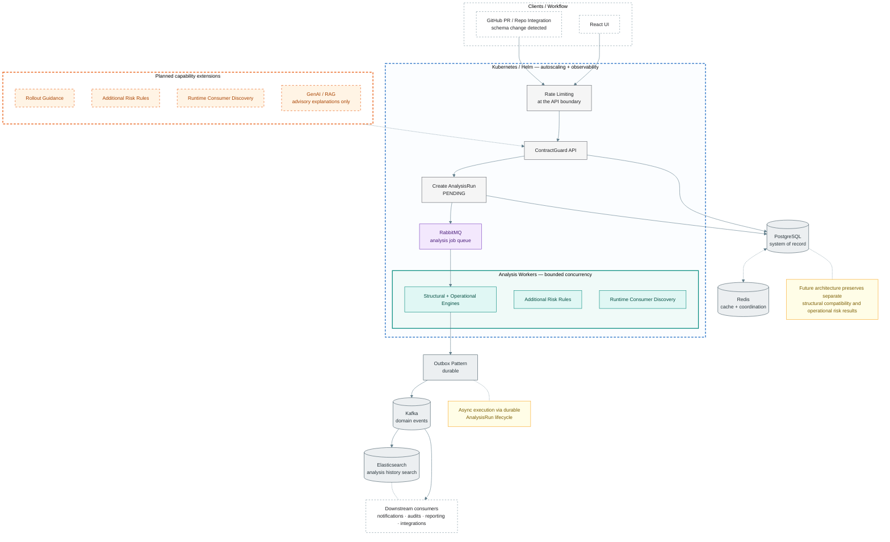

# ContractGuard — Architecture

**A structural compatibility PASS does not imply operational safety.**

ContractGuard analyses a proposed Avro schema change and reports two *independent* results —
structural compatibility, and operational risk backed by evidence from consumer source. They are
never merged into a single verdict. The architecture makes that separation structural rather than
conventional.

---

## Current architecture

```mermaid
%%{init: {"theme":"base","themeVariables":{"primaryColor":"#f5f5f5","primaryTextColor":"#202124","primaryBorderColor":"#9e9e9e","lineColor":"#607d8b","clusterBkg":"#ffffff","clusterBorder":"#b0bec5","fontSize":"14px"}}}%%
flowchart LR

  subgraph INPUTS["Inputs"]
    direction TB
    AVRO["Avro Contracts<br/>Baseline V1 + Proposed V2"]
    JSRC["Java Consumer Source<br/>registered services"]
  end

  subgraph CG["ContractGuard — Spring Boot Modular Monolith"]
    direction TB

    API["REST API<br/>Projects · Schema Versions · Analyses"]
    ORCH["Analysis Orchestrator<br/>executes one AnalysisRun"]
    API --> ORCH

    subgraph STRUCT["Structural Contract Analysis"]
      direction TB
      DIFF["Schema Diff Engine<br/>fields · enums · defaults · optionality"]
      COMPAT["Avro Compatibility Engine<br/>BACKWARD · FORWARD · FULL"]
      DIFF --> COMPAT
    end

    subgraph OPS["Operational Risk Analysis"]
      direction TB
      REG["Consumer Registry"]
      AST["JavaParser AST Scanner"]
      RULES["Risk Rules<br/>ENUM_SEMANTIC_FALLBACK_RISK"]
      EV["Source Evidence<br/>service · file · line · code"]
      REG --> AST --> RULES --> EV
    end

    CRES["Structural<br/>Compatibility Result"]
    ORES["Operational<br/>Findings + Evidence"]

    HIST["AnalysisRun / History<br/>compatibility snapshot<br/>risk findings + evidence<br/>status + timestamps"]
    PG[("PostgreSQL<br/>durable analysis history")]
  end

  EXAMPLE["Example<br/>RETURNED added<br/>Avro: compatible at this field<br/>Consumer: RETURNED → CREATED fallback<br/>Evidence: case CREATED → sendNewOrderNotification"]
  THESIS["Compatibility PASS ≠ operational safety"]

  AVRO --> API
  JSRC --> REG
  ORCH -- "V1 + V2" --> DIFF
  ORCH -- "V1 + V2 + source" --> REG
  COMPAT --> CRES
  EV --> ORES
  CRES --> HIST
  ORES --> HIST
  HIST --> PG
  ORES -.- EXAMPLE
  HIST -.- THESIS

  classDef neutral fill:#f5f5f5,stroke:#5f6368,stroke-width:1px,color:#202124
  classDef structural fill:#e8f0fe,stroke:#1565c0,stroke-width:1px,color:#0d47a1
  classDef operational fill:#fff4e5,stroke:#e65100,stroke-width:1px,color:#a84300
  classDef storage fill:#eceff1,stroke:#455a64,stroke-width:1px,color:#263238
  classDef input fill:#ffffff,stroke:#78909c,stroke-width:1px,color:#202124
  classDef callout fill:#fffde7,stroke:#f9a825,stroke-width:1px,color:#7a5c00

  class API,ORCH,HIST neutral
  class DIFF,COMPAT,CRES structural
  class REG,AST,RULES,EV,ORES operational
  class PG storage
  class AVRO,JSRC input
  class EXAMPLE,THESIS callout

  style CG fill:#ffffff,stroke:#37474f,stroke-width:2px
  style INPUTS fill:#ffffff,stroke:#78909c,stroke-dasharray:4 4
  style STRUCT fill:#f4f8fe,stroke:#1565c0,stroke-width:2px
  style OPS fill:#fff9f2,stroke:#e65100,stroke-width:2px
```



### Request flow

Schema V1/V2 and consumer source enter on the left. The API creates an **AnalysisRun**, the
orchestrator fans out to **two independent analyses**, and their two separate result sets are
persisted as one immutable snapshot in PostgreSQL.

1. **Inputs** — Avro V1/V2 arrive through the API. Java consumer source is a *separate* input and
   reaches only the operational-risk branch.
2. **API → Orchestrator** — one `AnalysisRun` is created and committed before analysis begins,
   moving `PENDING → RUNNING`.
3. **Structural branch** — the diff engine derives field, enum, default and optionality changes;
   the compatibility engine derives BACKWARD/FORWARD/FULL. Both read **schemas only**.
4. **Operational branch** — the consumer registry supplies source, JavaParser builds ASTs, and the
   risk rules combine AST facts with the diff to produce findings carrying file-and-line evidence.
5. **Persistence** — both result sets are written relationally in a single transaction, and the run
   moves to `COMPLETED` (or `FAILED`, which is retained rather than rolled back).
6. **Rollout** — the planner reads the *stored snapshot only*, so old guidance can never change
   because consumer source changed on disk.

### Why the branches are separate

The compatibility engine answers *can these bytes be decoded?* — a question about two schemas. The
operational-risk engine answers *will the receiving code behave?* — a question about code. Different
inputs, different algorithms, different verdicts.

`compatibility` and `consumeranalysis` have no dependency on each other in either direction, and
tests assert that neither result payload contains the other's fields. The `Rollout Planner` is the
only component that reads both, and it produces ordered *guidance*, never a merged verdict.

### PostgreSQL's responsibility

It is the single source of truth for durable analysis history: projects, schema versions, and the
immutable `AnalysisRun` snapshot (compatibility results and issues, risk findings, finding
attributes, source evidence). Schema is managed by Flyway. Nothing else stores state.

---

## Planned architecture evolution

The current design is a modular monolith. Additional infrastructure is introduced only where a
concrete performance or reliability need justifies it.



### Why each component appears

| Component | Reason |
|---|---|
| **Rate limiting** | Sits at the API boundary because AST analysis is CPU-bound and a single caller could otherwise saturate the workers. |
| **RabbitMQ** | Decouples request from execution once analyses outgrow a synchronous HTTP call; the `PENDING → RUNNING` lifecycle already exists, so the queue only changes *who* calls the store. |
| **Analysis workers** | Move CPU-bound diff, compatibility and AST work off the request thread so API latency stops tracking analysis cost. |
| **Bounded concurrency** | Lives inside the workers because parsing many consumer files in parallel must have a ceiling, or memory and CPU scale with input size rather than with capacity. |
| **Redis** | Caches parsed schemas and AST results, which are pure functions of immutable input, and coordinates workers so one job is not analysed twice. |
| **Kafka / Outbox** | Publishes domain events *after* the analysis is durably stored, so downstream consumers never observe a result the database has not committed. |
| **Elasticsearch** | Indexes analysis history for search across projects, rules and consumers — a query shape PostgreSQL serves poorly at volume. |
| **Kubernetes** | Hosts the API and worker tiers as independently scalable deployments; it is a deployment substrate, not a step in the analysis flow. |

The capability extensions are deliberately separated from infrastructure: they change what
ContractGuard can *detect*, not how it runs. GenAI appears only as an advisory explanation layer
over findings a deterministic rule already produced — it never generates findings, because results
must stay reproducible and auditable.

---

## Regenerating the diagrams

The Mermaid source below is the source of truth. `README.md` embeds pre-rendered PNGs so the
diagrams display in editors whose Markdown preview lacks Mermaid support; GitHub renders Mermaid
blocks natively.

Sources: [`docs/img/architecture-current.mmd`](img/architecture-current.mmd) ·
[`docs/img/architecture-planned.mmd`](img/architecture-planned.mmd)

```bash
npx -y @mermaid-js/mermaid-cli -i docs/img/architecture-current.mmd -o docs/img/architecture-current-light.png -b white -s 2
```

```bash
npx -y @mermaid-js/mermaid-cli -i docs/img/architecture-planned.mmd -o docs/img/architecture-planned-light.png -b white -s 2
```
